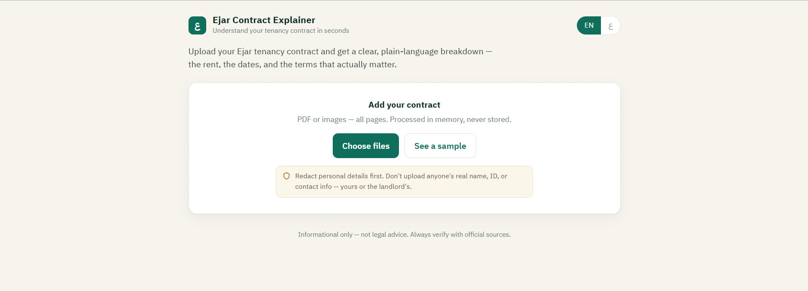

# Ejar Contract Explainer

Turn a Saudi **Ejar** tenancy contract (عقد إيجار) into clear, structured data — the rent,
the dates, and the terms that actually matter — in seconds. Bilingual (Arabic / English),
privacy-first, and built to run on a **free local open-source model** for development and
**Anthropic Claude** in production.

<!-- Replace USERNAME after you create the repo -->

> **Why this is hard (and interesting):** formal Saudi government Arabic is exactly where
> general tools degrade — RTL layout, legal phrasing, and bilingual fields. This project is
> about the engineering *around* a vision model: a strict extraction schema, a pluggable
> model backend, and a privacy posture that assumes real personal documents will be uploaded.

## Screenshot
<!-- Add one: run the app, open it, screenshot, and save to docs/screenshot.png -->

## What it does
- Reads a contract as **PDF or images**, **multi-page**, via a vision model.
- Extracts a **validated schema**: parties (PII-stripped), property, financials, the full
  payment schedule, and key legal terms (duration, auto-renewal notice, late-payment grace,
  the daily holdover penalty).
- Renders the result in a clean **bilingual AR/EN, RTL-aware** interface.

## Pluggable model backend
One interface, two implementations, switchable with a single env var — no code change.

| Provider | When | Cost | Set in `.env` |
|---|---|---|---|
| **Ollama** (Qwen2.5-VL) | local development / testing | free | `EXTRACTOR_PROVIDER=ollama` |
| **Anthropic** (Claude) | production | API usage | `EXTRACTOR_PROVIDER=anthropic` |

    app/extractors/
      base.py                 # VisionExtractor interface
      ollama_extractor.py     # local, free
      anthropic_extractor.py  # production, schema tool-forced
      factory.py              # picks one from EXTRACTOR_PROVIDER

## Quickstart (free, local)
    python -m venv .venv && source .venv/bin/activate
    pip install -r requirements.txt
    cp .env.example .env                 # EXTRACTOR_PROVIDER=ollama

    # install Ollama from https://ollama.com, then:
    ollama pull qwen2.5vl

    uvicorn app.main:app --reload        # open http://localhost:8000

Click **"See a sample"** to view the UI populated without uploading anything.

## Production (Anthropic)
    EXTRACTOR_PROVIDER=anthropic
    ANTHROPIC_API_KEY=sk-ant-...
    ANTHROPIC_MODEL=claude-sonnet-4-6

## Deploy
A `Dockerfile` is included. Deploy the container to Fly.io / Render / Railway and set the
env vars there; FastAPI serves the frontend too, so one service ships both. Use the
**Anthropic** backend in the cloud (the local model needs a GPU). For real user documents,
host in a Saudi/region cloud and confirm provider data-retention terms first.

## Privacy & safety (by design)
- **Stateless** — documents are processed in memory; nothing is written to disk or a database.
- The model is instructed to **null out** names, IDs, emails, phones, and addresses.
- **No document content in logs** (only provider + latency).
- The UI asks users to redact before upload and offers a no-upload sample.
- **Not legal advice.** Output is informational; always verify with official sources.

## Roadmap
- [x] **v1 — extraction layer** (this release): image/PDF → validated structured data, bilingual UI.
- [ ] **v2 — insight layer:** plain-language explanations, deadline alerts, the renewal trap & exit-penalty flags, grounded in cited clauses.
- [ ] **v3 — grounding & eval:** RAG over Saudi rental procedures, plus an accuracy/eval harness comparing open models vs. Claude on real Arabic contracts.

## License
MIT — see [LICENSE](LICENSE).

---
*Built in public. Notes and write-ups accompany each phase.*
